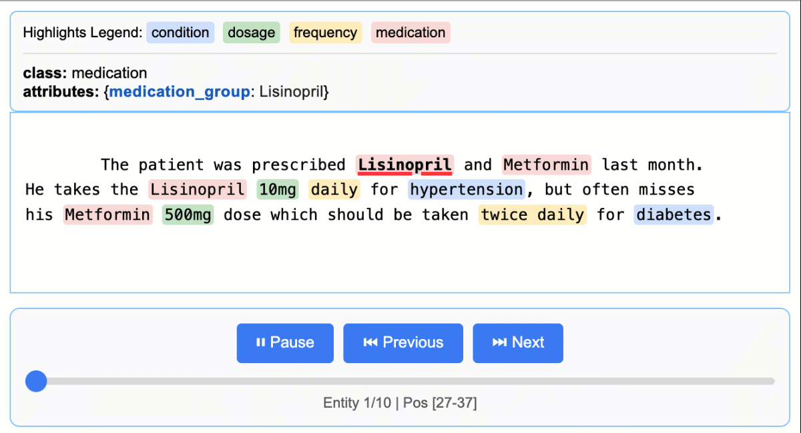

# Medication Extraction Examples

LangExtract excels at extracting structured medical information from clinical text, making it particularly useful for healthcare applications. The methodology originated from research in medical information extraction, where early versions of the techniques were demonstrated to accelerate annotation tasks significantly.

> **Disclaimer:** This demonstration is only for illustrative purposes of LangExtract's baseline capability. It does not represent a finished or approved product, is not intended to diagnose or suggest treatment of any disease or condition, and should not be used for medical advice.

---

**Medical Information Extraction Research:**
The concepts and methods underlying LangExtract were first demonstrated in:

Goel, A., Lehman, E., Gulati, A., Chen, R., Nori, H., Hager, G. D., & Durr, N. J. (2023).
"LLMs Accelerate Annotation for Medical Information Extraction."
*Machine Learning for Health (ML4H), PMLR, 2023*.
[arXiv:2312.02296](https://arxiv.org/abs/2312.02296)

---

## Basic Named Entity Recognition (NER)

In this basic medical example, LangExtract extracts structured medication information:

```python
import langextract as lx

# Text with a medication mention
input_text = "Patient took 400 mg PO Ibuprofen q4h for two days."

# Define extraction prompt
prompt_description = "Extract medication information including medication name, dosage, route, frequency, and duration in the order they appear in the text."

# Define example data with entities in order of appearance
examples = [
    lx.data.ExampleData(
        text="Patient was given 250 mg IV Cefazolin TID for one week.",
        extractions=[
            lx.data.Extraction(extraction_class="dosage", extraction_text="250 mg"),
            lx.data.Extraction(extraction_class="route", extraction_text="IV"),
            lx.data.Extraction(extraction_class="medication", extraction_text="Cefazolin"),
            lx.data.Extraction(extraction_class="frequency", extraction_text="TID"),  # TID = three times a day
            lx.data.Extraction(extraction_class="duration", extraction_text="for one week")
        ]
    )
]

result = lx.extract(
    text_or_documents=input_text,
    prompt_description=prompt_description,
    examples=examples,
    model_id="gemini-2.5-pro",
    api_key="your-api-key-here"  # Optional if LANGEXTRACT_API_KEY environment variable is set
)

# Display entities with positions
print(f"Input: {input_text}\n")
print("Extracted entities:")
for entity in result.extractions:
    position_info = ""
    if entity.char_interval:
        start, end = entity.char_interval.start_pos, entity.char_interval.end_pos
        position_info = f" (pos: {start}-{end})"
    print(f"• {entity.extraction_class.capitalize()}: {entity.extraction_text}{position_info}")

# Save and visualize the results
lx.io.save_annotated_documents([result], output_name="medical_ner_extraction.jsonl", output_dir=".")

# Generate the interactive visualization
html_content = lx.visualize("medical_ner_extraction.jsonl")
with open("medical_ner_visualization.html", "w") as f:
    f.write(html_content)

print("Interactive visualization saved to medical_ner_visualization.html")
```


This will produce an output similar to:

```
Input: Patient took 400 mg PO Ibuprofen q4h for two days.

Extracted entities:
• Dosage: 400 mg (pos: 13-19)
• Route: PO (pos: 20-22)
• Medication: Ibuprofen (pos: 23-32)
• Frequency: q4h (pos: 33-36)
• Duration: for two days (pos: 37-49)
Interactive visualization saved to medical_ner_visualization.html
```

The interactive HTML visualization allows you to explore the extracted entities visually, with each entity type color-coded and clickable for detailed inspection.

## Relationship Extraction (RE)

For more complex extractions that involve relationships between entities, LangExtract can also extract structured relationships. This example shows how to extract medications and their associated attributes:

```python
import langextract as lx

# Text with interleaved medication mentions
input_text = """
The patient was prescribed Lisinopril and Metformin last month.
He takes the Lisinopril 10mg daily for hypertension, but often misses
his Metformin 500mg dose which should be taken twice daily for diabetes.
"""

# Define extraction prompt
prompt_description = """
Extract medications with their details, using attributes to group related information:

1. Extract entities in the order they appear in the text
2. Each entity must have a 'medication_group' attribute linking it to its medication
3. All details about a medication should share the same medication_group value
"""

# Define example data with medication groups
examples = [
    lx.data.ExampleData(
        text="Patient takes Aspirin 100mg daily for heart health and Simvastatin 20mg at bedtime.",
        extractions=[
            # First medication group
            lx.data.Extraction(
                extraction_class="medication",
                extraction_text="Aspirin",
                attributes={"medication_group": "Aspirin"}  # Group identifier
            ),
            lx.data.Extraction(
                extraction_class="dosage",
                extraction_text="100mg",
                attributes={"medication_group": "Aspirin"}
            ),
            lx.data.Extraction(
                extraction_class="frequency",
                extraction_text="daily",
                attributes={"medication_group": "Aspirin"}
            ),
            lx.data.Extraction(
                extraction_class="condition",
                extraction_text="heart health",
                attributes={"medication_group": "Aspirin"}
            ),

            # Second medication group
            lx.data.Extraction(
                extraction_class="medication",
                extraction_text="Simvastatin",
                attributes={"medication_group": "Simvastatin"}
            ),
            lx.data.Extraction(
                extraction_class="dosage",
                extraction_text="20mg",
                attributes={"medication_group": "Simvastatin"}
            ),
            lx.data.Extraction(
                extraction_class="frequency",
                extraction_text="at bedtime",
                attributes={"medication_group": "Simvastatin"}
            )
        ]
    )
]

result = lx.extract(
    text_or_documents=input_text,
    prompt_description=prompt_description,
    examples=examples,
    model_id="gemini-2.5-pro",
    api_key="your-api-key-here"  # Optional if LANGEXTRACT_API_KEY environment variable is set
)

# Display grouped medications
print(f"Input text: {input_text.strip()}\n")
print("Extracted Medications:")

# Group by medication
medication_groups = {}
for extraction in result.extractions:
    if not extraction.attributes or "medication_group" not in extraction.attributes:
        print(f"Warning: Missing medication_group for {extraction.extraction_text}")
        continue

    group_name = extraction.attributes["medication_group"]
    medication_groups.setdefault(group_name, []).append(extraction)

# Print each medication group
for med_name, extractions in medication_groups.items():
    print(f"\n* {med_name}")
    for extraction in extractions:
        position_info = ""
        if extraction.char_interval:
            start, end = extraction.char_interval.start_pos, extraction.char_interval.end_pos
            position_info = f" (pos: {start}-{end})"
        print(f"  • {extraction.extraction_class.capitalize()}: {extraction.extraction_text}{position_info}")

# Save and visualize the results
lx.io.save_annotated_documents(
    [result],
    output_name="medical_ner_extraction.jsonl",
    output_dir="."
)

# Generate the interactive visualization
html_content = lx.visualize("medical_relationship_extraction.jsonl")
with open("medical_relationship_visualization.html", "w") as f:
    f.write(html_content)

print("Interactive visualization saved to medical_relationship_visualization.html")
```



This will produce output similar to:

```
Input text: The patient was prescribed Lisinopril and Metformin last month.
He takes the Lisinopril 10mg daily for hypertension, but often misses
his Metformin 500mg dose which should be taken twice daily for diabetes.

Extracted Medications:

* Lisinopril
  • Medication: Lisinopril (pos: 28-38)
  • Dosage: 10mg (pos: 89-93)
  • Frequency: daily (pos: 94-99)
  • Condition: hypertension (pos: 104-116)

* Metformin
  • Medication: Metformin (pos: 43-52)
  • Dosage: 500mg (pos: 149-154)
  • Frequency: twice daily (pos: 182-193)
  • Condition: diabetes (pos: 198-206)
Interactive visualization saved to medical_relationship_visualization.html
```

The visualization highlights how the `medication_group` attributes connect related entities, making it easy to see which dosages, frequencies, and conditions belong to each medication. Each medication group is visually distinguished in the interactive display.

**Understanding Relationship Extraction:**
This example demonstrates how attributes enable efficient relationship extraction. Using the `medication_group` attribute as a linking key, related entities are grouped together logically. This approach simplifies extracting connected information and eliminates the need for additional processing steps, while preserving the precise alignment between extracted text and its original location in the document. The interactive visualization makes these relationships immediately apparent, with connected entities sharing visual groupings and color coding.

## Key Features Demonstrated

- **Named Entity Recognition**: Extracts entities with their types (medication, dosage, route, etc.)
- **Relationship Extraction**: Groups related entities using attributes
- **Position Tracking**: Records exact positions of extracted entities in the source text
- **Structured Output**: Organizes information in a format suitable for healthcare applications
- **Interactive Visualization**: Generates HTML visualizations for exploring complex medical extractions with entity groupings and relationships clearly displayed
